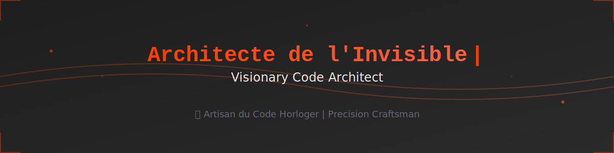

# 

---

## 
🇫🇷 Du design corporate unique aux architectures DAOs post-quantiques

## 
🇬🇧 From unique corporate design to post-quantum DAO architectures

### J'orchestre la complexité en systèmes vivants exceptionnels.
### I orchestrate complexity into exceptional living systems.

 

<table align="center">
<tr>
<td align="center" width="50%">

### 🏗️ Architecte de l'Invisible
*Visionary Code Architect*

</td>
<td align="center" width="50%">

### 🎨 Artisan du Code Horloger
*Precision Craftsman*

</td>
</tr>
</table>

---

## 🎯 FOCUS

<table>
<tr>
<td align="center" width="25%">
 
<b>DeFi Security</b> 
Vulnerability Research
</td>
<td align="center" width="25%">
 
<b>Post-Quantum</b> 
Cryptography
</td>
<td align="center" width="25%">
 
<b>AI DAOs</b> 
Autonomous Systems
</td>
<td align="center" width="25%">
 
<b>AI Orchestrator</b> 
Intelligent Coordination
</td>
</tr>
</table>

---

## 🛠️ STACK & EXPERTISE

### Core Technologies

### Blockchain & DeFi

### AI & Machine Learning

### Post-Quantum & Cryptography

### Motion Design & Graphics

### Emerging Technologies

### Infrastructure & DevOps

### Specialized Skills

### Research & Engineering

---

## 📊 GITHUB ANALYTICS

  

---

## 🎭 ORCHESTRATION DE L'EXPERTISE | EXPERTISE ORCHESTRATION

🇫🇷 Je ne mesure pas mes compétences en pourcentages, je les **orchestre en systèmes vivants**.

🇬🇧 I don't measure my skills in percentages, I **orchestrate them into living systems**.

 

**Motion Design Architect** × **Full-Stack** × **DeFi Security Architect** × **AI/ML** × **Post-Quantum**

 

🇫🇷 Cette **fusion multidomaine** me permet de créer ce qui n'existe pas encore :  
des architectures où la créativité rencontre la sécurité,  
où le code devient art, où l'invisible prend vie.

🇬🇧 This **multidomain fusion** allows me to create what doesn't exist yet:  
architectures where creativity meets security,  
where code becomes art, where the invisible comes to life.

 

*"Artisan du Code Horloger -- Précision chirurgicale, vision holistique"*  
*"Horologist Code Craftsman -- Surgical precision, holistic vision"*

---

## 🌟 CURRENTLY WORKING ON

<table>
<tr>
<td width="25%" align="center">
 
<b>DeFi Vulnerability Research</b> 
Exploring smart contract security
</td>
<td width="25%" align="center">
 
<b>Post-Quantum Studies</b> 
Cryptography for tomorrow
</td>
<td width="25%" align="center">
 
<b>AI DAO Frameworks</b> 
Autonomous organizations
</td>
<td width="25%" align="center">
 
<b>Motion Design Systems</b> 
Next-gen visual experiences
</td>
</tr>
</table>

---

## 📫 CONNECT WITH ME

---

## ✨ Signature Philosophy | Philosophie Signature

### 🇫🇷 *"Avec précision chirurgicale, j'orchestre l'invisible en œuvres vivantes"*

### 🇬🇧 *"With surgical precision, I orchestrate the invisible into living works"*

 

**Made with 🧡 and SvelteKit**

Last updated: December 2025

---

