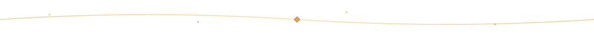

# 

[ 🇫🇷 **Français** ]&nbsp;&nbsp;•&nbsp;&nbsp;[ [🇬🇧 English](README.en.md) ]

  

---

## 
Architecte d'infrastructures IA souveraines : du concept à la résilience opérationnelle

### Je ne consomme pas la stack qu'on me vend. Je forge celle que je maîtrise.

 

<table align="center">
<tr>
<td align="center" width="50%">

# Architecte de Systèmes
*Doctrine, unités cognitives autonomes, infrastructures souveraines, noyau CORTEX*

</td>
<td align="center" width="50%">

### Artisan du code horloger
*Précision chirurgicale et vision d'ingénierie globale*

</td>
</tr>
</table>

---

## 🧭 CE QUE JE CONSTRUIS

CORTEX dépasse le cadre du simple outil : il s'agit d'une doctrine matérialisée en infrastructure. Six lois non négociables régissent un ensemble d'unités cognitives spécialisées. L'orchestration s'opère au sein d'une enceinte souveraine sous Podman rootless, avec des versions épinglées et sans aucune dépendance cachée. Chaque livrable constitue une preuve technique, jamais un prototype.

<table align="center">
<tr>
<td align="center" width="25%">
<b>◈ VITRA</b> 
Fabrique de vitrines marchandes souveraines (instance-zéro déployée)
</td>
<td align="center" width="25%">
<b>🜂 [ViTRA]_∴_OSiNT</b> 
Moteur OSINT Rust, WASM et Deno frontière éthique structurelle et non déclarative
</td>
<td align="center" width="25%">
<b>🧾 KXSIRH_Brain</b> 
SIRH souverain multi-tenant 50K+ collaborateurs, tri-couche cognitive
</td>
<td align="center" width="25%">
<b>⚔️ SANKORiA</b> 
Harnais CLI Rust Agents Autonomes | Architecture ReAct | Gouvernance
</td>
</tr>
</table>

---

## ⚖️ DOCTRINE : 6 LOIS NON NÉGOCIABLES

| Loi | Principe directeur |
|---|---|
| **Souveraineté** | Transparence absolue et auditabilité complète : refus des boîtes noires. |
| **Frugalité** | Performance maximale sous ressources minimales : l'élégance par la simplicité. |
| **Rigueur** | Bannissement des suppositions : seules les certitudes techniques font foi. |
| **Matérialisation** | Rejet de la théorie pure : chaque cycle de réflexion produit un livrable. |
| **Continuité** | Persistance des états : reprise immédiate de session sans perte de contexte. |
| **Propagation** | Intégrité du système : toute règle non câblée dans l'infrastructure est inexistante. |

---

## 🛠️ STACK SOUVERAINE

### Runtime & Langages : le socle, sans compromis

    

*Deno remplace Node.js. JSR prime sur npm. Standard ESM natif exclusif.*

---

### Infrastructure : maîtrise et hébergement physique

    

*Conteneurs rootless, versions figées et serveurs dédiés : élimination du verrouillage propriétaire lié au Cloud.*

---

### IA & Orchestration Cognitive

   

*Modèles propriétaires : Anthropic, Google DeepMind, OpenAI. Sélection stratégique selon domaine cognitif.*

---

### Inférence & Exécution Locale

       

*Inférence distribuée sur GPU. Modèles open-source diversifiés : Meta, Mistral, Google, Alibaba, NVIDIA. Souveraineté cognitive garantie. Zéro cloud propriétaire.*

---

### Orchestration & Protocoles Souverains

    

*Orchestration multi-agent décentralisée. Architecture propriétaire (CORTEX/ATHANOR). Agents gouvernés par doctrine structurée. Zéro dépendance cloud.*

---

### Fine-Tuning & Adaptation Contextuelle

       

*Adaptation légère et efficace. LoRA/QLoRA pour réduction mémoire 4-bit. PEFT pour paramètres optimisés. DeepSpeed pour scaling distribué. Axolotl et Unsloth pour workflows accélérés. Spécialisation sans réentraînement complet. Efficacité GPU maximale.*

---

### Web Souverain : rejet des frameworks par défaut

      

*Bannissement systématique de Tailwind et React. Priorité absolue : standards Web purs, minimalisme structurel, zéro dépendance de build. HTMX pour interactions hypermedia. Web Components pour modularité native. Alpine.js pour réactivité légère. Shoelace pour composants accessibles et souverains.*

---

### Motion Design & Présentation

      

*Mise en forme intelligible des données, architectures et flux logiciels. Motion design pour narratifs visuels. OBS pour capture et montage temps-réel. Blender pour 3D et visualisations complexes. FFmpeg pour traitement vidéo souverain. Manim pour animations mathématiques précises. Graphviz et PlantUML pour diagrammes d'architecture. Rendre les systèmes intelligibles pour décideurs et équipes techniques.*

---

## 📊 ACTIVITÉ GITHUB

<!-- GitHub Stats Principal -->

<!-- Langages Principaux -->

  

<!-- Graphe d'Activité de Forge -->

  

<!-- Streak Stats (optionnel mais puissant) -->

---

## 🌍 LA MISSION

---

## 🔐 Souveraineté Technologique

Je construis des infrastructures logicielles et cognitives que les organisations 
africaines et européennes **possèdent en propre**. 

L'objectif est d'exclure toute dépendance forcée à des tiers, de rejeter la location 
de services propriétaires et de refuser l'importation de technologies opaques.

**Chaque ligne de code demeure auditable.**  
**Chaque dépendance résulte d'un arbitrage souverain.**

---

 

**Sovereign Infrastructure** × **Cognitive Architecture** × **Rust/WASM Engineering** × **Motion Craft**

 

*◆ Précision chirurgicale. Orchestration souveraine. Chaque ligne auditable, chaque décision arbitrée, chaque infrastructure possédée.◆ *

---

## 🌟 EN CHANTIER ACTUELLEMENT

 

<!-- Titre Principal -->
<h2 style="letter-spacing: 2px; color: #D4AF37; font-weight: 300;">
  CORTEX ECOSYSTEM
</h2>

<!-- Sous-titre -->

  Quatre piliers de l'infrastructure cognitive souveraine

---

<!-- Grille de Modules -->

  <!-- Module 1: VITRA_∴_OSiNT -->
  

    
🜂

    

      <b style="color: #D4AF37; display: block; font-size: 16px; margin-bottom: 8px;">VITRA_∴_OSiNT</b>
      
        Moteur de recherche Rust & WASM 
        Contrôle éthique par conception
      
    

  

  <!-- Module 2: VITRA Studio -->
  

    
◈

    

      <b style="color: #D4AF37; display: block; font-size: 16px; margin-bottom: 8px;">VITRA Studio</b>
      
        Extension & réplication 
        Vitrines marchandes autonomes
      
    

  

  <!-- Module 3: KXSIRH_Brain -->
  

    
🧾

    

      <b style="color: #D4AF37; display: block; font-size: 16px; margin-bottom: 8px;">KXSIRH_Brain</b>
      
        Système SIRH souverain 
        Architecture tri-couche
      
    

  

  <!-- Module 4: SANKORiA -->
  

    
⚔️

    

      <b style="color: #D4AF37; display: block; font-size: 16px; margin-bottom: 8px;">SANKORiA</b>
      
        Harnais CLI Rust 
        Cortex-Qwen3 & GemmaTRON
      
    

  

---

 

---

## 📫 ME CONTACTER

 

<!-- Titre Section -->
<h3 style="letter-spacing: 2px; color: #D4AF37; font-weight: 300; margin-bottom: 24px;">
  CONNEXIONS
</h3>

<!-- Badges Réseaux Professionnels -->

  

  

  

<!-- Badge Portfolio Principal -->

  

---

<!-- Section Manifeste -->

  

    Déclaration
  

  

    <strong>Avec la précision de l'horloger, je façonne vos fondations : des infrastructures que vous possédez, auditez et contrôlez.</strong>
  

  

    Chaque ligne de code demeure auditable. 
    Chaque dépendance résulte d'un arbitrage souverain.
  

---

<!-- Pied de Section -->

  XARkeZION • Artisan du Code Horloger • Souveraineté Technologique

 

---

## ✨ Philosophie Signature

### *"Ce qui n'est pas monté n'existe pas. L'enceinte est souveraine."*

 

**Forgé avec rigueur en Rust, Deno et sous doctrine CORTEX.**

Dernière mise à jour : 2026

---

